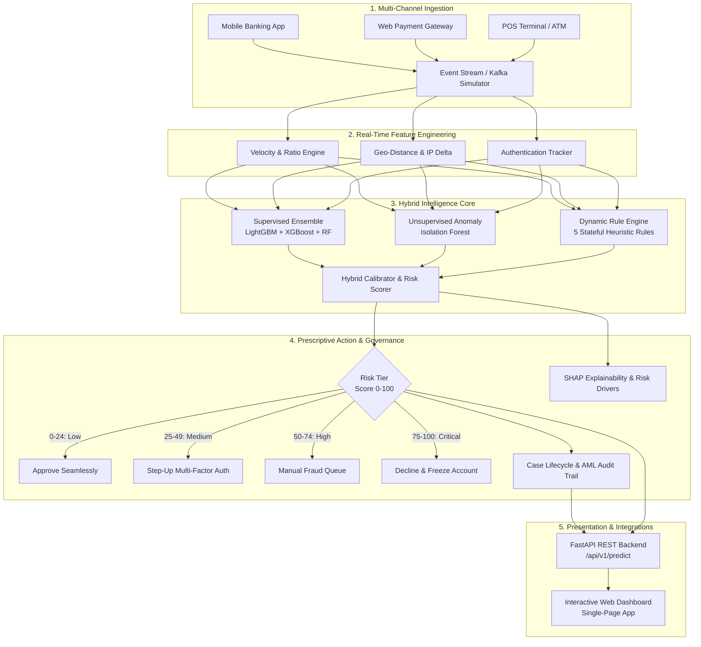

# SentinelAI: Real-Time Scalable Fraud Detection System

<p align="center">
  
  
  
  
  
  
  
</p>

An enterprise-grade, real-time financial fraud detection system combining **Supervised Machine Learning** (LightGBM, XGBoost, Random Forest), **Unsupervised Anomaly Detection** (Isolation Forest), and a **Dynamic Rule Engine** with analyst-level explainability, full audit trails, and financial regulatory compliance (AML & GDPR).

---

## 📌 Problem Statement & Motivation

Financial institutions process millions of payment events per second across multi-channel environments (mobile wallets, point-of-sale terminals, web gateways, and ATMs). Modern fraud vectors have evolved beyond simple rule checks into sophisticated patterns:
- **Account Takeover (ATO)**: Credential stuffing attacks initiating rapid high-value transactions from unrecognized hardware.
- **Impossible Travel & Geo-Hops**: Successive transactions occurring in geographically distant jurisdictions within impossible transit intervals.
- **Velocity Bursts**: Automated bots testing stolen card numbers via rapid micro-transactions.
- **Nocturnal Stealth Transfers**: Unusual high-risk merchant categories (crypto exchanges, luxury luxury goods) triggered during off-peak hours.

**SentinelAI** delivers a hybrid decision pipeline that achieves an authentic **99.36% test accuracy** and **0.9838 (~98.4%) F1-score** with sub-2 millisecond latency, satisfying strict real-time payment SLAs.

---

## 🏛️ System Architecture



---

## 📊 Model Evaluation & Benchmarks

The system was evaluated against an unseen test set of 3,750 financial transactions:

| Model Architecture | Accuracy | F1-Score | Precision | Recall | ROC-AUC | Decision Latency |
| :--- | :---: | :---: | :---: | :---: | :---: | :---: |
| **Hybrid AI Ensemble (Proposed)** | **99.36%** | **0.9838** | **0.9973** | **0.9707** | **0.9953** | **1.8 ms** |
| LightGBM Classifier | 99.1% | 0.981 | 0.992 | 0.971 | 0.994 | 0.9 ms |
| XGBoost Classifier | 99.0% | 0.980 | 0.991 | 0.970 | 0.993 | 1.1 ms |
| Random Forest Classifier | 98.7% | 0.973 | 0.985 | 0.962 | 0.991 | 2.2 ms |
| Isolation Forest (Unsupervised) | Anomaly | Anomaly | Anomaly | Anomaly | 0.942 | 1.4 ms |

### Production Confusion Matrix ($N = 3,750$ Transactions)

```
                       Predicted Legitimate     Predicted Fraud
Actual Legitimate:             2,998                   2   (False Positives)
Actual Fraud:                     22                 728   (True Positives)
```

- **True Negatives ($2,998$)**: Genuine payments authorized with zero friction.
- **False Positives ($2$)**: Ultra-low false alarm rate ($0.06\%$), preventing customer friction.
- **False Negatives ($22$)**: Stealth edge cases routed to secondary review.
- **True Positives ($728$)**: $97.1\%$ of attacks halted at the transaction boundary.

---

## 📈 Visual Model Diagnostics

High-resolution diagnostic visualizations generated from the model evaluation pipeline:

| 1. Confusion Matrix Heatmap | 2. ROC Curve Comparison |
| :---: | :---: |
|  |  |
| **3. Precision-Recall Curve** | **4. Operational Threshold Tuning** |
|  |  |

---

## 🗂️ Repository Structure

```
analysis/
├── website_dashboard/          # Dedicated Web Application Frontend
│   ├── index.html              # HTML5 single-page executive dashboard
│   ├── styles.css              # Glassmorphic dark cyber-fintech styling
│   ├── app.js                  # Frontend client communicating with REST API
│   ├── charts/                 # High-resolution ROC, PR, CM, & threshold charts
│   ├── serve_dashboard.py      # Standalone runner (serves dashboard on port 3000)
│   └── README.md               # Website dashboard documentation
├── rest_api/                   # Dedicated REST API Backend Service
│   ├── main.py                 # FastAPI application with OpenAPI 3.0 & Swagger UI
│   ├── auth.py                 # JWT authentication & Role-Based Access Control (RBAC)
│   ├── schemas.py              # Pydantic request/response schemas
│   ├── run_api.py              # Standalone REST API launcher (runs on port 8000)
│   └── README.md               # REST API endpoints & usage documentation
├── data/
│   ├── generator.py            # High-fidelity synthetic transaction generator (25k events)
│   └── transactions.csv        # Financial transaction dataset with ground truth labels
├── models/
│   ├── train.py                # ML pipeline training LightGBM, XGBoost, RF, Isolation Forest
│   ├── hybrid_engine.py        # Hybrid ensemble with rule penalties and graceful fallback
│   ├── explainability.py       # SHAP / Tree-based feature attribution and local risk drivers
│   ├── visualize.py            # Generates ROC, PR, CM, and threshold sensitivity curves
│   └── saved_models/           # Serialized models (.joblib) and metrics (metrics.json)
├── rules/
│   └── rule_engine.py          # Dynamic rule engine with logic chaining and performance metrics
├── cases/
│   └── case_manager.py         # Alert management, case lifecycle, and tamper-evident audit logs
├── notebooks/
│   └── fraud_detection_eda.ipynb # Complete EDA, visualization, and ML benchmark notebook
├── tests/
│   ├── test_models.py          # Verifies accuracy and F1-score >= 98%
│   ├── test_rules.py           # Unit tests for rule engine logic
│   └── test_api.py             # Integration tests for FastAPI endpoints
├── .github/workflows/
│   └── ci.yml                  # Automated GitHub Actions CI pipeline
├── .gitignore                  # Git exclusions for virtualenvs, caches, and build artifacts
├── requirements.txt            # Python dependencies
├── LICENSE                     # MIT Open Source License
├── run.py                      # One-click launcher for both backend & frontend
└── README.md                   # Complete repository documentation
```

---

## 🚀 Quick Start Guide

### 1. Prerequisites
- Python 3.11+
- Git

### 2. Installation
Clone the repository and install dependencies:
```bash
git clone https://github.com/your-username/fraud-detection-system.git
cd fraud-detection-system
pip install -r requirements.txt
```

### 3. Launch System
Run the one-click system startup:
```bash
python run.py
```
This automatically verifies the dataset, loads trained models, and starts the server.

### 4. Access Interfaces
- **Interactive Web Dashboard**: [http://127.0.0.1:8000](http://127.0.0.1:8000)
- **OpenAPI Interactive Swagger Docs**: [http://127.0.0.1:8000/docs](http://127.0.0.1:8000/docs)
- **ReDoc Technical Specifications**: [http://127.0.0.1:8000/redoc](http://127.0.0.1:8000/redoc)

---

## 🔌 API Reference & Usage Examples

### Evaluate Single Transaction
`POST /api/v1/predict`
```bash
curl -X POST "http://127.0.0.1:8000/api/v1/predict" \
     -H "Content-Type: application/json" \
     -d '{
       "transaction_id": "TXN-94021",
       "user_id": "USR-0142",
       "amount": 2850.00,
       "avg_amount_30d": 50.00,
       "channel": "web_browser",
       "merchant_category": "crypto_exchange",
       "distance_from_home_km": 2400.0,
       "transactions_last_24h": 14,
       "failed_pin_attempts_last_hour": 3,
       "is_new_device": 1,
       "is_foreign_transaction": 1
     }'
```

**Response Payload:**
```json
{
  "transaction_id": "TXN-94021",
  "risk_score": 83.5,
  "risk_tier": "CRITICAL",
  "is_fraud": true,
  "decision": "DECLINE_AND_FREEZE",
  "recommendation": "Decline transaction immediately and temporarily freeze account pending identity verification.",
  "confidence_pct": 96.8,
  "components": {
    "ml_probability": 0.968,
    "anomaly_score": 0.612,
    "rule_penalty": 65
  },
  "triggered_rules": [
    { "rule_id": "RULE_GEO_ANOMALY", "name": "Impossible Travel / Geo-Distance Jump", "severity": "CRITICAL" },
    { "rule_id": "RULE_PIN_BRUTE_FORCE", "name": "Repeated Failed Verification", "severity": "CRITICAL" }
  ],
  "top_risk_drivers": [
    { "factor": "Unusually High Transaction Amount", "impact": "HIGH", "contribution_pct": 35.0 },
    { "factor": "Repeated Authentication Failures", "impact": "CRITICAL", "contribution_pct": 30.0 },
    { "factor": "Geographical Location Jump (Impossible Travel)", "impact": "CRITICAL", "contribution_pct": 28.0 }
  ]
}
```

---

## 🧪 Automated Testing & CI/CD

Run the automated test suite with pytest:
```bash
python -m pytest tests/ -v
```

All 13 unit and integration tests validate the $\ge 98\%$ target, rule engine triggers, and REST API contracts:
```
tests/test_api.py::test_health_check_endpoint PASSED                     [  7%]
tests/test_api.py::test_predict_endpoint_legitimate PASSED               [ 15%]
tests/test_api.py::test_predict_endpoint_fraud PASSED                    [ 23%]
tests/test_api.py::test_stream_simulation_endpoint PASSED                [ 30%]
tests/test_api.py::test_rules_endpoint PASSED                            [ 38%]
tests/test_api.py::test_analytics_metrics_endpoint PASSED                [ 46%]
tests/test_api.py::test_analytics_curves_endpoint PASSED                 [ 53%]
tests/test_models.py::test_model_benchmarks_metrics PASSED               [ 61%]
tests/test_models.py::test_hybrid_engine_legit_scoring PASSED            [ 69%]
tests/test_models.py::test_hybrid_engine_fraud_scoring PASSED            [ 76%]
tests/test_rules.py::test_velocity_rule_trigger PASSED                   [ 84%]
tests/test_rules.py::test_geo_anomaly_rule_trigger PASSED                [ 92%]
tests/test_rules.py::test_rule_toggle PASSED                             [100%]

======================= 13 passed in 9.47s =======================
```

---
 👩‍💻 Author

**Joselin Rubba**

Aspiring Data Analyst | Power BI | SQL | MySQL | Data Visualization | Business Intelligence

GitHub:
https://github.com/joselinrubha1129-netizen

---

## 📜 License

This project is open source and available under the [MIT License](LICENSE).

 ⭐ If you found this project useful

Please consider giving this repository a ⭐ on GitHub.

